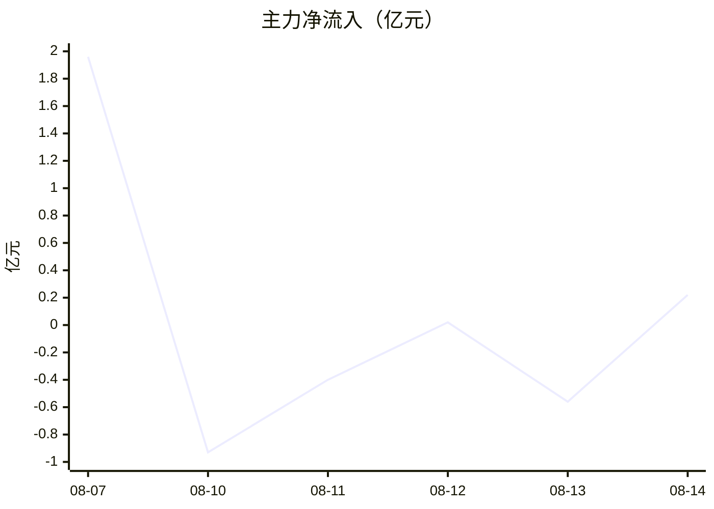

# 晶方科技（603005）资金流向

> 每日主力资金净流向跟踪。数据源：东方财富资金流（按单笔金额分超大单/大单/中单/小单，**主力=超大单+大单，第三方估算，仅供参考**）。每日收盘后由 cron 自动更新（15:40）。
> 用法：连续流入=资金关注，连续流出+股价滞涨=警惕；资金流是辅助指标，不单独作为决策依据。

| 日期 | 主力净流 | 占比 | 超大单 | 大单 | 收盘 | 涨跌 | 信号 |
|------|---------|------|--------|------|------|------|------|
| 2026-08-07 | +1.96亿 | 8.76% | +0.49亿 | +1.47亿 | 33.79 | +4.61% | 放量流入 |
| 2026-08-10 | -0.93亿 | -7.12% | -0.45亿 | -0.47亿 | 33.02 | -2.28% | 流出 |
| 2026-08-11 | -0.40亿 | -4.28% | -0.19亿 | -0.21亿 | 32.77 | -0.76% | 流出 |
| 2026-08-12 | +0.02亿 | 0.21% | +0.16亿 | -0.14亿 | 33.35 | +1.77% | 基本平衡 |
| 2026-08-13 | -0.56亿 | -4.26% | -0.49亿 | -0.08亿 | 33.10 | -0.75% | 流出（买入日） |
| 2026-08-14 | +0.22亿 | 2.36% | -0.11亿 | +0.33亿 | 33.51 | +1.24% | 小幅回流 |

## 资金流向图（近 20 日，自动更新）

## 近 5 日趋势小结（自动更新）

- 主力 5 日净流合计：约 -1.65 亿
- 最近 1 日净流入
- 解读：资金流为第三方估算，仅作辅助参考（详见文件头说明）
> 历史缺口：08-06 及更早数据待东财接口恢复后自动补齐（cron 按日期去重追加）。
